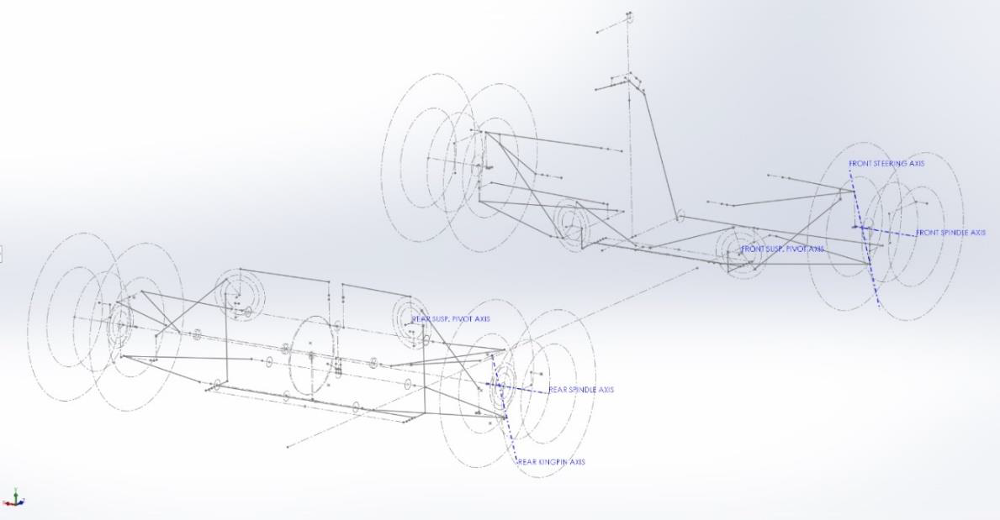
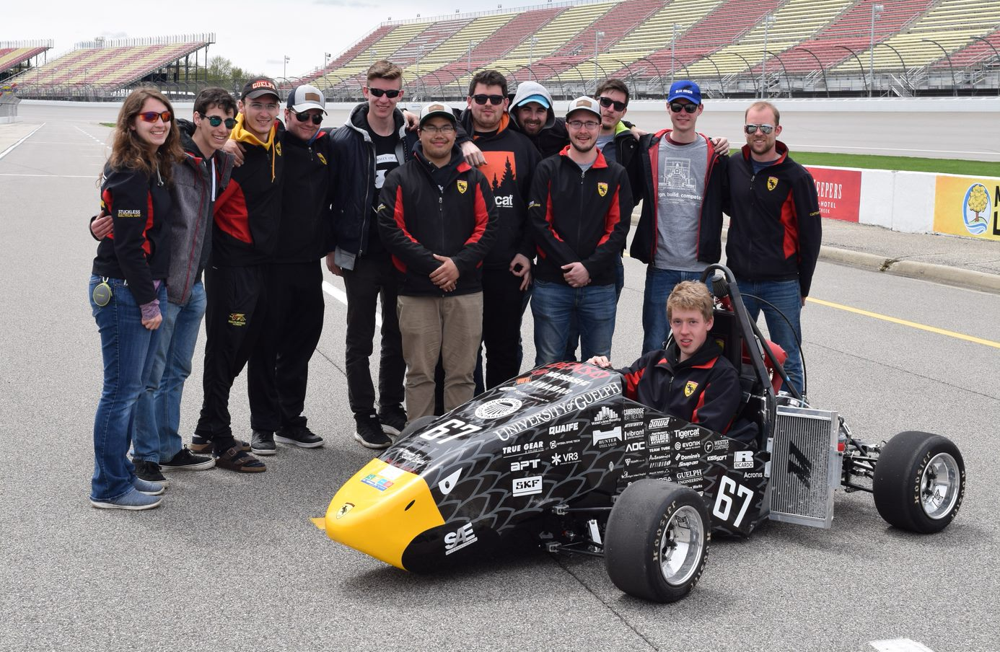

# About
The chance to be a member of the Gryphon Racing Formula SAE team was the highlight of my time at the University of Guelph. The role helped me to appreciate the complexity of real-world systems, the necessity to make data driven decisions while remembering the limitations of my knowledge and methods, and the need for validation of results and continual reassessment. The race team was a way to gain practical experience across many stages of the engineering process, such as systems analysis, mechanical design, CAD, structural analysis and FEA, and manufacturing.

### 2018-2019 Suspension Lead
• Managed a team of 7 people carrying out the design and manufacturing of suspension and steering components  
• Responsible for performing vehicle dynamics analysis to set systems-level design goals for an open wheeled race car   
• Designed all-new suspension and steering setups for an updated 10" wheel package  
• Received highest Suspension Design score at competition since team inception in 2002, and was one of the team's 4 competition drivers  
• Developed a MATLAB based program for visualizing tire test data and fitting Semi-Empirical Pacejka tire models, using data generated by the FSAE Tire Testing Consortium  
• Completed two group design projects for course credit, developing a carbon fibre rim design and shock dynomometer

### 2017-2018 Suspension Member
• Design and manufacturing of custom steering rack and steering column assembly  
• Machining of various parts using manual mill, manual lathe, CNC mill  
• Attendance of team events for sponsorship and promotion  

### 2016-2017 Chassis Member
• Helped with building of a steel space frame chassis & general fabrication for frame components   
• Design of pedal box assembly  

